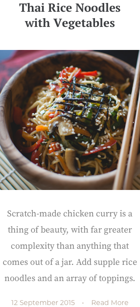
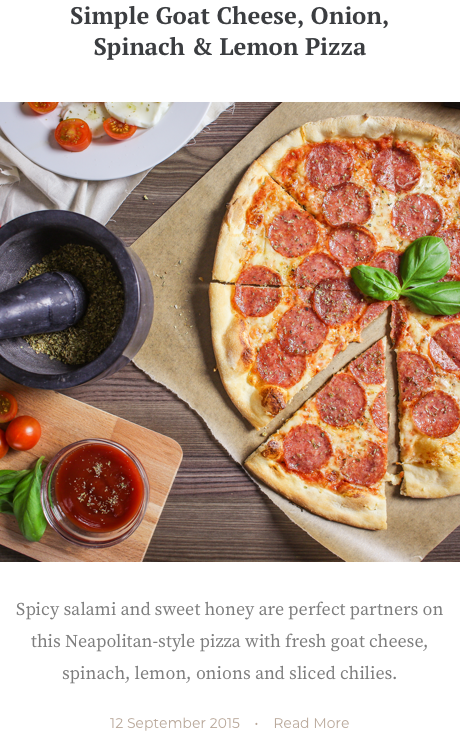
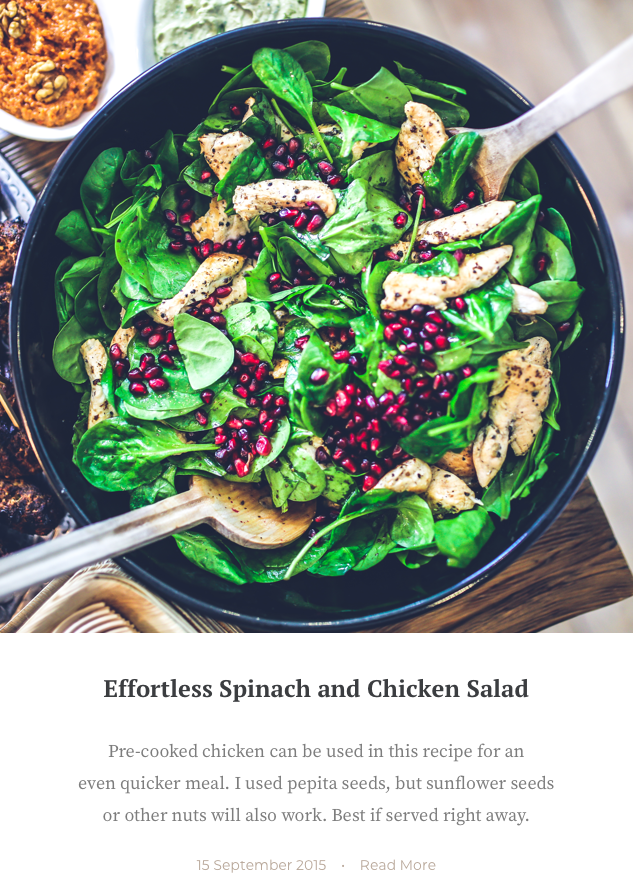

# The Good Life Blog (Concept Demo)

Live concept demo with mockup borrowerd from ui8.net, built using [ReactJS](https://reactjs.org/).

## Demo

//insert link

## Screenshots

//insert screenshots

## Cards

> src/components/ui/card.js

Cards are led by a beautiful image and concise information on a certain topic or recipe. They are interactive and easily understood by users.

### Props:
| Name        | Type           | Default  |
| ----------- |:-------------:| -----:|
| id    |   string | -  |
| title |   string | Lorem text |
| description | string | Lorem text |
| image | string(url) | - |
| date | string | Random date|
| ~~comments~~ | - | - |

### Example: Recipe data

```
const data = {
    "id": "69d539e7de35d229e6707787a03dc5098418da02",
    "name": "Effortless Spinach and Chicken Salad",
    "description": "Pre-cooked chicken can be used in this recipe for an even quicker meal. I used pepita seeds, but sunflower seeds or other nuts will also work. Best if served right away. Pre-cooked chicken can be used in this recipe for an even quicker.",
    "date": "15 September 2015",
    "tags": 
    [ "western", "italian", "lunch" ] 
}
```
*Note: "date" is not present in the recipe.json source file. It is randomly generated by rDate() module, in the component file card.js*

### Example: Small cards



```
<CardSm 
    id={data.id}
    title={data.name}
    description={data.description}
    date={data.date} />
```

### Example: Medium cards



```
<CardMd 
    id={data.id}
    title={data.name}
    description={data.description}
    date={data.date} />
```

### Example: Large cards



```
<CardLg 
    id={data.id}
    title={data.name}
    description={data.description}
    date={data.date} />
```

## Ingredient 

> src/components/ui/ingredient.js

### Props:
| Name        | Type           | Default  |
| ----------- |:-------------:| -----:|
| children    |   string | -  |

### Example: Ingredient item


```
<Item>1/2 cup feta or goat cheese, crumbled</Item>
```

## Tag

> src/components/ui/tag.js

### Props:
| Name    | Type   | Default  |
| ----------- |:-------------:| -----:|
| children    |   string | -  |

### Example: Tag


```
<Tag>Lunch</Tag>
<Tag>Quick Meal</Tag>
<Tag>Vegetarian</Tag>
```


## Tools

- HTML
- SaSS
- ReactJS
- React Router
- Sketch
- VSCode
- Chrome

## Credits

- Mockup freebie from [ui8.net](https://ui8.net/onno/products/minimal-food-blog)
- [Heroku-React buildpack](https://github.com/mars/create-react-app-buildpack)

